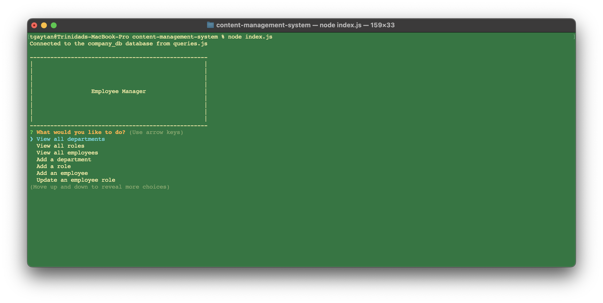
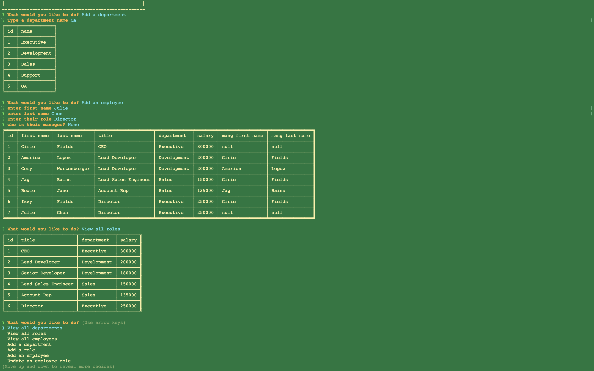

# content-management-system

## Description

This CMS (content management system) allows users to organize and plan their business.  With this application, a user can add departments, roles, and employees to their company database.  It is written in JavScript and runs via command line with Node.js, and connects to a MySQL databsae.  The code was also written using "then" chains in order to get familiar with using promise chains.

## Installation

1.  Download the files from this reposity to your local machine
2.  'cd' to the path where the package.json file is located and run the command "npm i" to install the necessary packages
3.  From the same directory, connect to the MySQL Server and run the following commands (only run command 'b' if you want to use test data)
    a.  source db/schema.sql
    b.  source db/seeds.sql
4.  Update the utils/queries.js to have your environment's database information (lines 7-9)

## Usage

The following steps outline how to launch and use the application.

1.  If you would like to use test data and have not yet imported it, review step 4b under the [Installation](#installation) section  
2.  'cd' to the root of the file structure and run "node index.js".  Here is a screenshot of the result.
    
3.  Choose one of the options and follow the on-screen prompts to interact and view the contents of your database.  The following screenshot shows the application after use
    

A recording of the application in use can be found here: https://drive.google.com/file/d/12QX-NNb-P4JuJbzTCPzs0MixE4eniznc/view